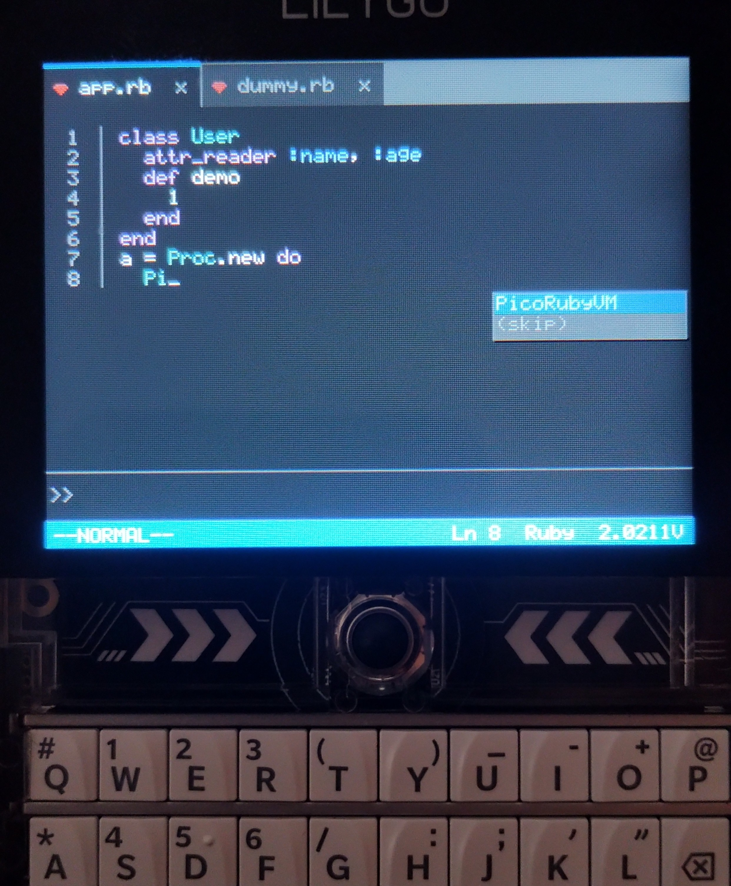

# Pro Editor Pocket for PicoRuby 🧑‍💻✨



## A VS Code–like Editor in Your Pocket 🎒

**ProEditorPocket** is a VS Code–inspired editor that allows you to  
edit and execute PicoRuby code directly on your device 🚀

📌 **This software is designed exclusively for the T-Deck Plus.**  
It is not intended to run on other devices.

---

## Setup ⚙️

### Step 1: Initialize submodules 📦

```bash
git submodule update --init --recursive
```

---

### Step 2: Update CMakeLists 🛠️

Edit `components/picoruby-esp32/CMakeLists.txt`

Add the following entries to `SRCS`:

```cmake
${COMPONENT_DIR}/../picoruby-tft/ports/esp32/tft_native.c
${COMPONENT_DIR}/../picoruby-tft/ports/esp32/st7789_spi.c
```

Add the following entry to `INCLUDE_DIRS`:

```cmake
${COMPONENT_DIR}/../picoruby-tft/include
```

---

### Step 3: Update build configuration 🧩

Edit `components/picoruby-esp32/picoruby/build_config/xtensa-esp.rb`

```ruby
conf.gem File.expand_path('../../picoruby-tft', __dir__)
```

---

### Step 4: Build and flash 🔥

```bash
. $(YOUR_ESP_IDF_PATH)/export.sh
idf.py set-target esp32s3
idf.py build
idf.py flash
```

---

## Features ✨

- Line numbers with automatic alignment 📏
- Ruby syntax highlighting (keywords, strings, numbers, variables, etc.) 🎨
- Multi-line input with automatic indentation ↩️
- Basic code completion 🧠
- Press `Return` twice to execute the code ▶️
- 8-slot Save / Load to SD Card 💾
- Trackball cursor navigation in editor 🕹️
---

## Special Key Mapping ⌨️

The keyboard layout is mostly identical to the default T-Keyboard configuration.  
However, some keys are specially assigned to make Ruby coding more convenient.

The following symbols can be entered by pressing the `sym` key first,  
then holding `Shift` while pressing the corresponding key.

- `=` : `Shift + Q`
- `[` : `Shift + G`
- `]` : `Shift + H`
- `{` : `Shift + V`
- `}` : `Shift + B`
- `<` : `Shift + Z`
- `>` : `Shift + X`
- `|` : `Shift + $`

---

## Special Controls 🕹️

### Trackball 🕹️

| Context | Direction | Action |
|---------|-----------|--------|
| Editor (normal) | Up / Down / Left / Right | Move cursor within code |
| Completion popup | Up / Down | Select completion candidate |
| Result area | Left / Right | Scroll horizontally |
| Slot modal | Left / Right | Select slot (0–7) |

### Keyboard Shortcuts ⌨️

| Shortcut | Action |
|----------|--------|
| Alt + C | Clear all currently entered code |
| Sym → Shift + S | Open **Save** slot modal (SD Card) |
| Sym → Shift + L | Open **Load** slot modal (SD Card) |
| Return | Confirm selected slot in modal |
| Backspace | Cancel slot modal |

### SD Card Save / Load 💾

Code can be saved to and loaded from 8 slots (`slot0.rb` – `slot7.rb`) on the SD Card.

1. Press `Sym → Shift + S` (save) or `Sym → Shift + L` (load) to open the slot selection modal
2. Use the trackball to choose a slot (0–7)
3. Press `Return` to confirm, or `Backspace` to cancel

---

## Known Issues ⚠️

- Repeated execution may exhaust system resources and cause the device to restart
- If any buttons stop responding, try resetting or reflashing the device
